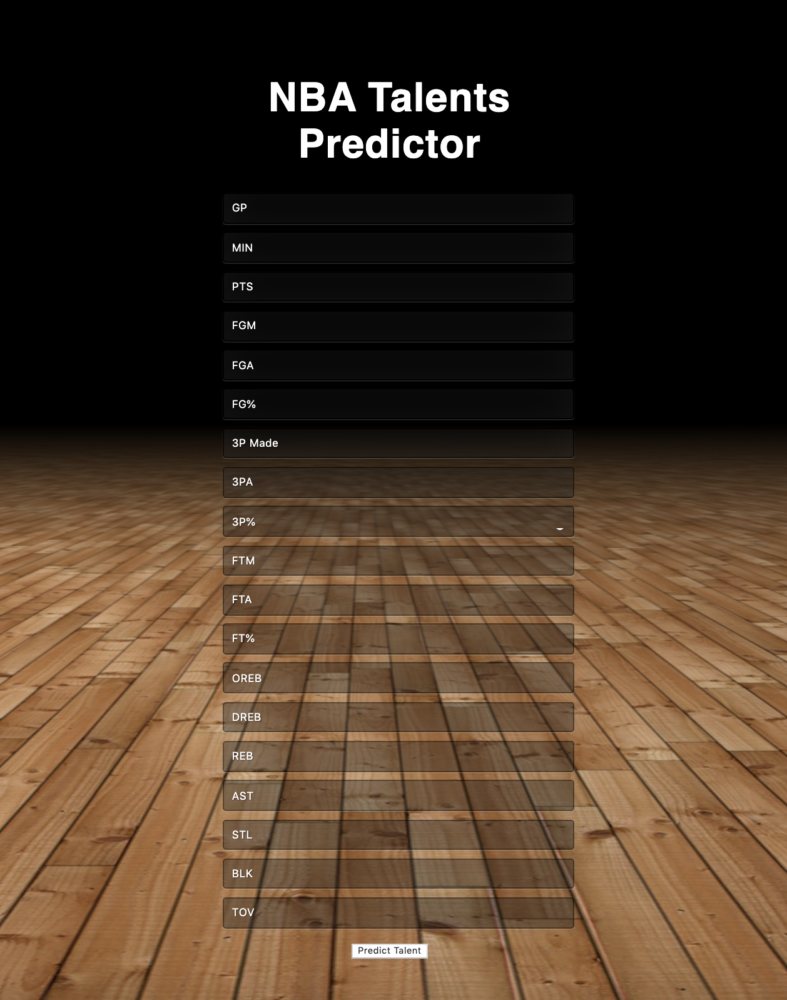

# NBA talents predictor
#
#
### Deploy web service and web application using docker

#
#### 1- Build docker image
```sh
$ docker build -t nba .
```
#
#### 2- Run docker container
```sh
$ docker run --name nba-web-service -p 5000:5000 nba:latest
```


### Access to web application
Browse [http://localhost:5000/nba-ml/player](http://localhost:5000/nba-ml/player)

### Interface



### Query web service
```sh
$ curl --location --request POST 'http://0.0.0.0:5000/api/nba-ml/player' \
    --header 'Content-Type: application/json; charset=UTF-8' \
    --data-raw '{
	    "data": [58, 11.6, 5.7, 2.3, 5.5, 42.6, 0.1, 0.5, 22.6, 0.9, 1.3, 68.9, 1, 0.9, 1.9, 0.8, 0.6, 0.1, 1]
    }'
```
#### Response format
JSON format with a single key-value pair (key = 'prediction').
